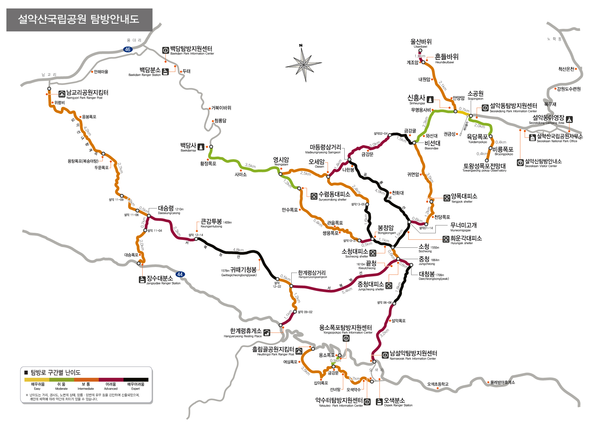

1. 첫번째 아이템
2. 두번째 아이템
3. 세번째 아이템
   * 세번째 리스트
   * 세번째의 리스트
4. 4번째 아이템
5. 5번째 아이템 

용어
: 이렇게 하는 건가. 작동 안하는데

to do list
- [X] 할 일 1
- [ ] 할 일 2
- [ ] 할 일 3

        #include <stdio.h>
        int main(){
            int a = 1;
            int b = 2;
            printf("%d",a+b);
            return 0;
        }

<!-- 절대 경로로 하면 안 됨 -->

내가 링크를 만들어 볼께 [link](https://naver.com "네이버로 연결").

click to open [about us](./about_us.md "우리에 관하여")

파일 이름 같은 거에 공백 사용하지 마라 굳이 쓰려면 %20쓰면 공백 표현 가능

[link](./with blank.md "이건 불가능")

[link](./with%20blank.md "이렇게 써야 가능")

|Header1|Header2|
|-------|-------|
|Header | Title |
|abc    |abc    |
|엄청길때는 어떻게 될까 이렇게 늘어날까|이렇게늘어나도 된는 걸깡하ㅏ하하하하 |

This is foodnode [^1]

[^1]: 설명설명

~~취소선~~
==하이라이트==

H~2~O  
X^2^

? 위에껀 안되넹